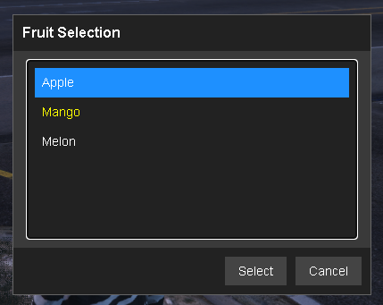
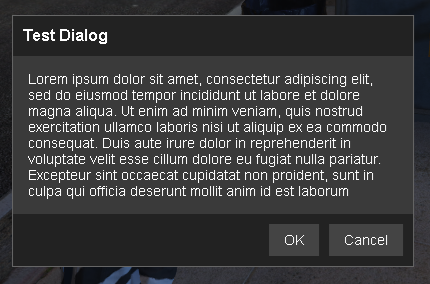
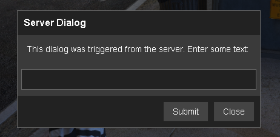

# SAM Dialog
Is sa-mp dialog design-look-a-like for FiveM, the function and usage are same like the sa-mp docs, yet another utility if you do miss a masterpiece memories

### Screenshot
<details>
  <summary>Screenshot 1</summary>
  
</details>

<details>
  <summary>Screenshot 2</summary>
  
</details>

<details>
  <summary>Screenshot 3</summary>
  
</details>


# Usage
The usage is pretty simple just put it on your `resources` files and `ensure SAM-dialog` in server.cfg, you can use both in server or client side.

```lua
RegisterCommand("serverdialog", function(source, args, rawCommand)
    local dialogid = 5
    local style = 1  -- DIALOG_STYLE_INPUT
    local title = "Server Dialog"
    local body = "This dialog was triggered from the server. Enter some text:"
    local button1 = "Submit"
    local button2 = "Close"
    ShowPlayerDialog(source, dialogid, style, title, body, button1, button2)
end, false)
```


## Callback

Every functions trigger  server event called 

```lua
AddEventHandler("OnDialogResponse", function(dialogid, response, listitem, inputtext)end)
```

## DIALOG_STYLE:style

```lua
Style 0: DIALOG_STYLE_MSGBOX
Style 1: DIALOG_STYLE_INPUT
Style 2: DIALOG_STYLE_LIST
Style 3: DIALOG_STYLE_PASSWORD
Style 4: DIALOG_STYLE_TABLIST
Style 5: DIALOG_STYLE_TABLIST_HEADERS
```


It's still work in progress so it only support style 0-2.

Feel free to open an issue, and contribute are welcomed.